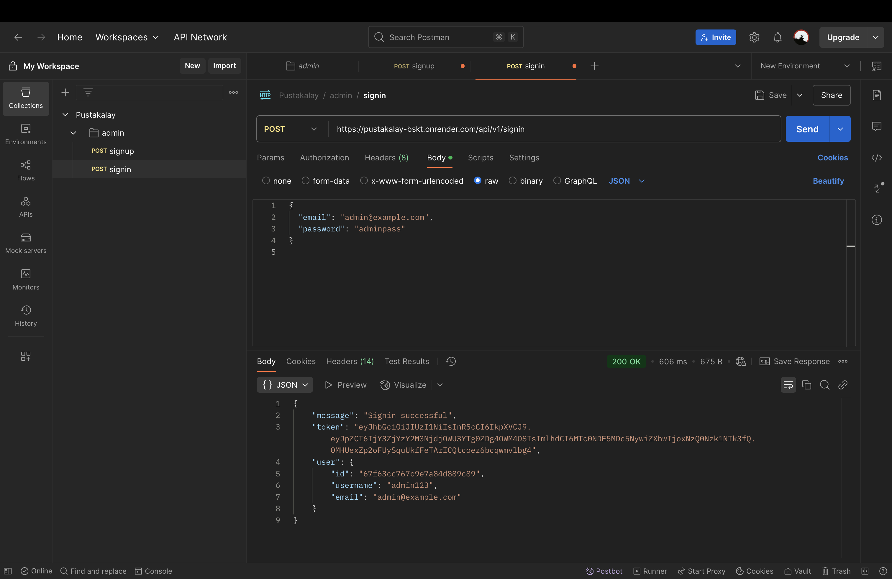
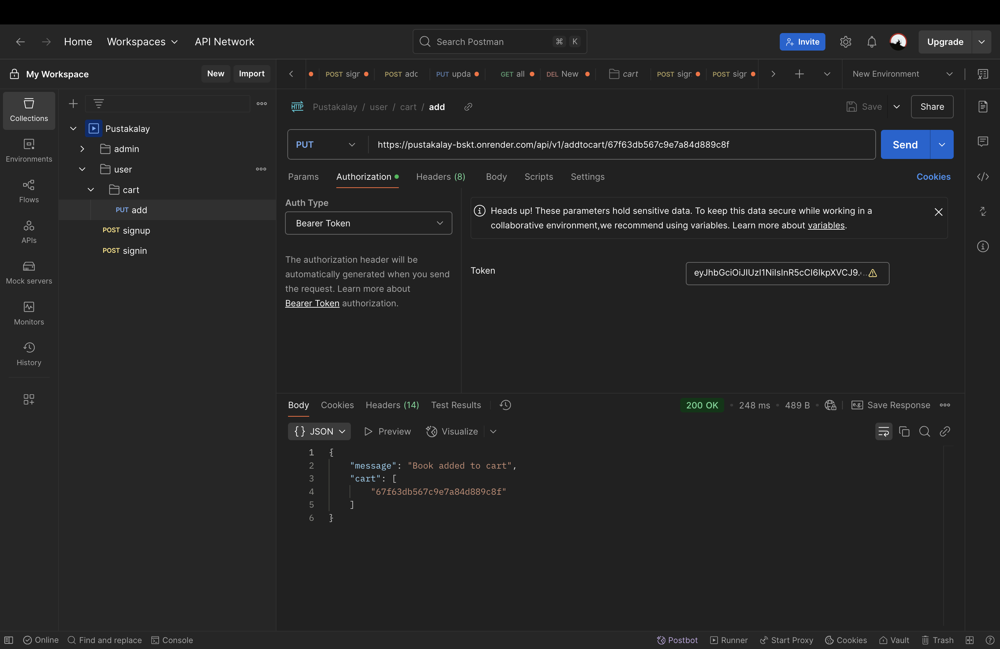
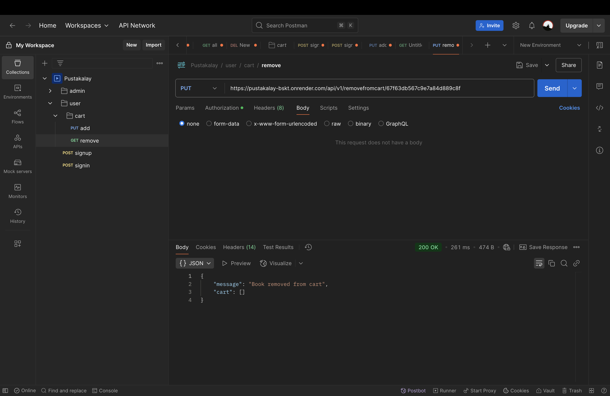
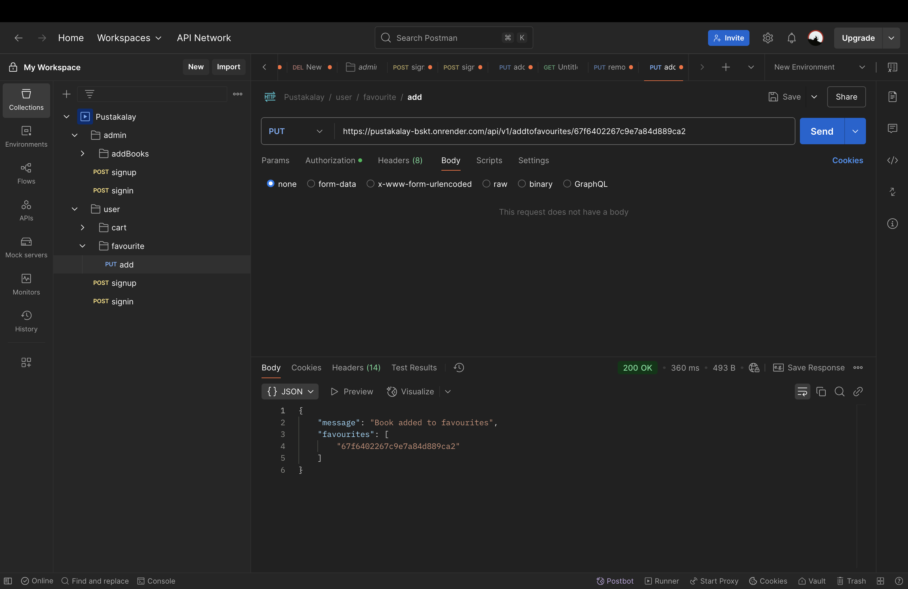
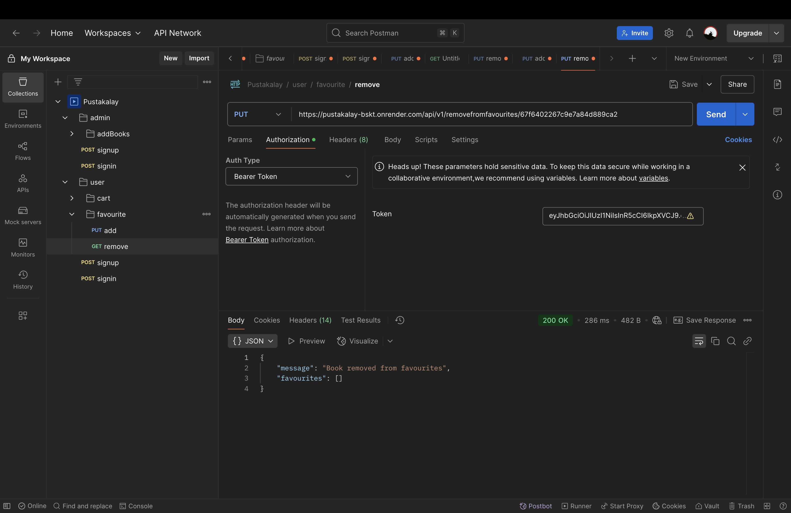

<h1 align="center">📚 Kitaabi Kidaa (Pustakalay)</h1>

<p align="center">A full-featured book store backend with authentication, admin control, cart & favourites — built for modern applications.</p>

<p align="center">
  <a href="https://nodejs.org"></a>
  <a href="https://expressjs.com/"></a>
  <a href="https://www.mongodb.com/"></a>
  <a href="https://jwt.io/"></a>
  <a href="https://www.npmjs.com/"></a>
  <a href="https://zod.dev"></a>
  <a href="https://javascript.dev"></a>
</p>

---

### 🔗 Live API Base URL

> [https://pustakalay-bskt.onrender.com/api/v1](https://pustakalay-bskt.onrender.com/api/v1)

---

### 🔐 Authentication & User Routes

| Method | Endpoint          | Description               | Access  |
| ------ | ----------------- | ------------------------- | ------- |
| POST   | `/signup`         | Register a new user       | Public  |
| POST   | `/signin`         | Login and get JWT token   | Public  |
| GET    | `/userInfo`       | Get logged-in user's data | Private |
| PUT    | `/update_address` | Update user's address     | Private |

---

### 📘 Book Routes

| Method | Endpoint              | Description                 | Access |
| ------ | --------------------- | --------------------------- | ------ |
| POST   | `/addbook`            | Add a new book (admin only) | Admin  |
| PUT    | `/updatebook/:bookId` | Update book details         | Admin  |
| DELETE | `/deletebook/:bookId` | Delete book                 | Admin  |
| GET    | `/allbooks`           | Get all books               | Public |

---

### 🛒 Cart Routes

| Method | Endpoint                  | Description           | Access  |
| ------ | ------------------------- | --------------------- | ------- |
| PUT    | `/addtocart/:bookId`      | Add book to user cart | Private |
| PUT    | `/removefromcart/:bookId` | Remove book from cart | Private |

---

### ❤️ Favourite Routes

| Method | Endpoint                    | Description                 | Access  |
| ------ | --------------------------- | --------------------------- | ------- |
| PUT    | `/addtofavourites/:bookId`  | Add book to favourites      | Private |
| PUT    | `/removefavourites/:bookId` | Remove book from favourites | Private |

---

### 🧑‍💻 User Model Structure

```js
{
  username,
  email,
  password,
  address,
  avatar,
  role: "user" | "admin",
  favourites: [bookId],
  cart: [bookId],
  orders: [orderId]
}
```

**🔐 Private** means the route requires a valid JWT token and can only be accessed by logged-in users.

```erDiagram
    USER ||-->{ BOOK : "favourites"
    USER ||-->{ BOOK : "cart"
    USER ||-->{ ORDER : "orders"
    BOOK {
        String _id
        String title
        String author
        String price
        String language
    }
    USER {
        String _id
        String username
        String email
        String password
        String address
        String role
    }
    ORDER {
        String _id
        String userId
        Date orderDate
        Array books
    }

```
---
---

### Admin Signup



### 🔐 Admin Signin


### 📚 Add Book _(Only Admin)_

.png>)

---

### 📝 Update Book _(Only Admin)_

## .png>)

### ❌ Remove Book _(Only Admin)_

.png>)

---

### 📖 Get All Books _(All Users)_

.png>)

## 🛒 Cart & ❤️ Favourites

### ➕ Add to Cart



---

### ❌ Remove from Cart



---

### ❤️ Add to Favourites



---

### 💔 Remove from Favourites




---

> ⚠️ **Note:** While signing up, users do **not need to provide the `role` field**. By default, the role is set to `"user"` internally. Only admins are added manually or through separate logic.